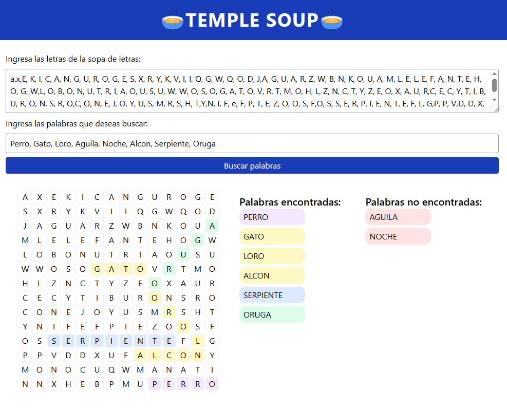

# 🥣 TempleSoup: Buscador de Palabras en Sopa de Letras

## Descripción del proyecto
TempleSoup es una aplicación web interactiva que permite a los usuarios crear una sopa de letras personalizada y buscar palabras dentro de ella. El usuario ingresa:

- **Letras de la sopa de letras:** 196 letras separadas por comas, que conforman una matriz de 14x14.
- **Palabras a buscar:** Una lista de palabras separadas por comas.

La aplicación muestra la sopa de letras en pantalla. Las palabras encontradas se resaltan con distintos colores, y se listan junto con aquellas que no fueron encontradas (estas últimas en rojo).

## Tecnologías empleadas
- **💎 Framework:** Next.js (React)
- **🎨 Estilos:** Tailwind CSS
- **📕 Lenguaje:** JavaScript
- **🔨 Editor:** Trae


## Recursos especiales

Durante el desarrollo de este proyecto se consultaron los siguientes recursos:

- [Documentación oficial de Next.js](https://nextjs.org/docs)
- [Documentación de Tailwind CSS](https://tailwindcss.com/docs)
- [W3Schools - Referencia de JavaScript](https://www.w3schools.com/jsref/default.asp)
- [ChatGPT (OpenAI)](https://chatgpt.com/)

Gran parte del código fue desarrollado de forma autónoma. Se usó ChatGPT específicamente para:
- Sugerir el uso de un arreglo de direcciones y la implementación de la función `buscarDesde`, como se muestra a continuación:
```javascript
// 6. Creamos un arreglo con las posibles direcciones de busqueda
const directions = [
    [0, 1], // derecha
    [0, -1], // izquierda
    [1, 0], // abajo
    [-1, 0], // arriba
    [1, 1], // diagonal ↘
    [1, -1], // diagonal ↙
    [-1, 1], // diagonal ↗
    [-1, -1] // diagonal ↖
]
```

```javascript
function buscarDesde (x, y, dx, dy, palabra, matriz) {
    const positions = []
    // 8.1 Recorremos la longitud de la palabra
    for (let k = 0; k < palabra.length; k++) {
        // 8.2 Definimos la posición actual en la matriz en función de la posición inicial (x,y) y la dirección (dx,dy).
        const nx = x + (dx * k)
        const ny = y + (dy * k)

        // 8.3 Verificamos si la posición actual está fuera de los límites de la matriz.
        if (nx < 0 || ny < 0 || nx >= filas || ny >= columnas) {
            return null
        }

        // 8.4 Comparamos la letra de la posición actual de la matriz con la letra de la palabra que deseamos buscar.
        if (matriz[nx][ny] !== palabra[k]) {
            return null
        }

        // 8.5 Si la letra es igual, agregamos la posición actual al arreglo de posiciones.
        positions.push([nx, ny])
    }

    // 8.r Si en ningún punto del ciclo se retorna false, significa que la palabra se encontró, por lo que retornamos las posiciones de la palabra encontrada.
    return positions
}
```
  
## Cómo ejecutar el proyecto

> ⚠️ Asegúrate de tener instalado [Node.js](https://nodejs.org/)

1. Clona el repositorio:
```bash
git clone https://github.com/JHerrera458/temple-soup.git
cd templesoup
```

2. Instala las dependencias del proyecto utilizando:
   
```bash
npm i
```

3. Inicia la aplicación en modo desarrollo usando:

```bash
npm run dev
```

4. Abre tu navegador web y accede a la aplicación en [http://localhost:3000](http://localhost:3000)
También puedes usar la aplicación desplegada en producción [aquí 👇](https://temple-soup.vercel.app/)

## Vista previa del proyecto

